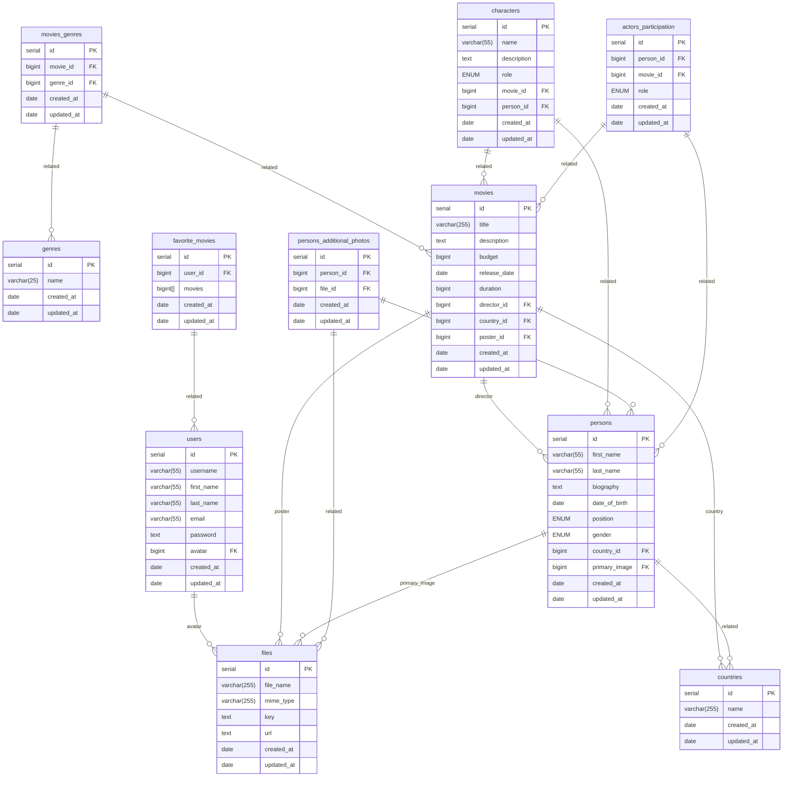

```mermaid
erDiagram
genres {
    serial id PK
    varchar(25) name
    date created_at
    date updated_at
}
countries {
    serial id PK
    varchar(255) name
    date created_at
    date updated_at
}
files {
    serial id PK
    varchar(255) file_name
    varchar(255) mime_type
    text key
    text url
    date created_at
    date updated_at
}
users ||--o{ files : avatar
users {
    serial id PK
    varchar(55) username
    varchar(55) first_name
    varchar(55) last_name
    varchar(55) email
    text password
    bigint avatar FK
    date created_at
    date updated_at 
}
movies ||--o{ files: poster
movies ||--o{ persons: director
movies ||--o{ countries: country
movies {
    serial id PK
    varchar(255) title
    text description
    bigint budget
    date release_date
    bigint duration
    bigint director_id FK
    bigint country_id FK
    bigint poster_id FK
    date created_at
    date updated_at
}
movies_genres ||--o{ movies: related 
movies_genres ||--o{ genres: related
movies_genres {
    serial id PK
    bigint movie_id FK
    bigint genre_id FK
    date created_at
    date updated_at
}
persons ||--o{ countries: related
persons ||--o{ files: primary_image
persons {
    serial id PK
    varchar(55) first_name
    varchar(55) last_name
    text biography
    date date_of_birth
    ENUM position
    ENUM gender
    bigint country_id FK
    bigint primary_image FK
    date created_at
    date updated_at   
}
characters ||--o{ movies: related
characters ||--o{ persons: related
characters {
    serial id PK
    varchar(55) name
    text description
    ENUM role
    bigint movie_id FK
    bigint person_id FK
    date created_at
    date updated_at
}
persons_additional_photos ||--o{ persons: related
persons_additional_photos ||--o{ files: related
persons_additional_photos {
    serial id PK
    bigint person_id FK
    bigint file_id FK
    date created_at
    date updated_at
}
actors_participation ||--o{ persons: related
actors_participation ||--o{ movies: related
actors_participation {
    serial id PK
    bigint person_id FK
    bigint movie_id FK
    ENUM role
    date created_at
    date updated_at
}
favorite_movies ||--o{ users: related
favorite_movies {
    serial id PK
    bigint user_id FK
    bigint[] movies
    date created_at
    date updated_at
}
```